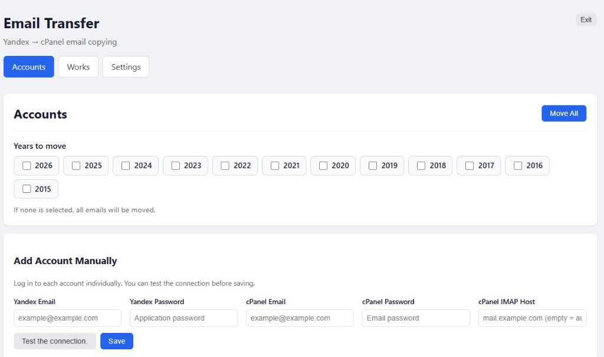
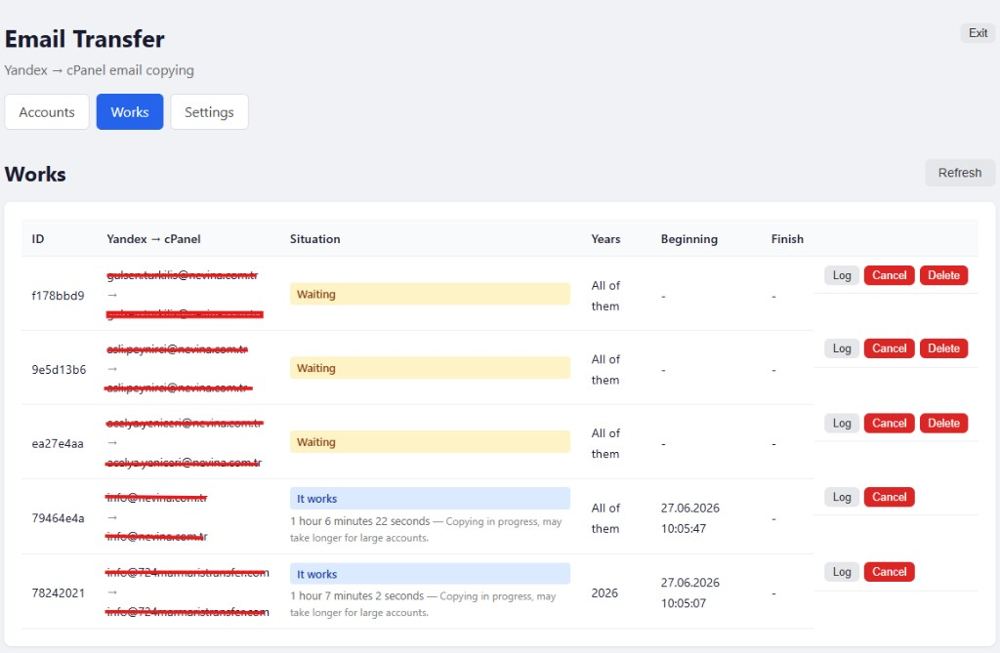

# Yandex → cPanel Email Migration

Web-based tool to **copy** mail from Yandex Mail accounts to matching cPanel mailboxes. Messages on the source account are not deleted.

🇹🇷 [Türkçe dokümantasyon](README.tr.md)

## Features

- Manual account entry and bulk CSV import
- Yandex IMAP → cPanel IMAP migration via [imapsync](https://imapsync.lamiral.info/)
- **Year filter** — migrate mail from selected years only (single job per account)
- Job queue with parallel workers (configurable concurrency)
- **UUID-based jobs** — each job has a unique ID and log file (`job-{uuid}.log`)
- Live status, folder progress, and log viewer
- JWT-protected admin panel
- Passwords encrypted at rest (Fernet)
- SQLite database + Redis job queue

## Screenshots

### Accounts



- Select **years to migrate** (empty = all mail)
- Add accounts manually or import CSV
- **Test connection** before saving
- Filter tabs: All / Waiting / Running / Completed / Failed

### Jobs



- Each job has a unique **UUID** (short ID shown in table)
- Status: Waiting, Running, Completed, Failed
- **Log**, **Cancel**, **Delete**, **Retry** actions
- Multiple jobs queue; worker processes them in parallel

> Add your screenshots to `docs/images/accounts.png` and `docs/images/jobs.png` if they are not in the repo yet.

## Server settings

### Yandex (source)

| Setting | Value |
|---------|-------|
| IMAP server (Turkey) | `imap.yandex.com.tr` |
| IMAP server (outside Russia) | `imap.ya.ru` |
| Port | `993` |
| Security | SSL |

IMAP must be enabled on Yandex and you must use an **app password**.

### cPanel (destination)

| Setting | Value |
|---------|-------|
| IMAP server | `mail.YOURDOMAIN.com` (per domain) |
| Port | `993` |
| Security | SSL/TLS |
| Username | Full email address (e.g. `user@example.com`) |

## Installation

```bash
cp .env.example .env
```

Generate an encryption key:

```bash
python3 -c "from cryptography.fernet import Fernet; print(Fernet.generate_key().decode())"
```

Paste the output into `ENCRYPTION_KEY=` in `.env`.

### Admin login

The web UI requires authentication. Set these in `.env`:

| Variable | Description |
|----------|-------------|
| `ADMIN_USERNAME` | Panel username (default: `admin`) |
| `ADMIN_PASSWORD` | Panel password — use a strong value in production |
| `JWT_SECRET` | Session signing key — long random string |
| `JWT_EXPIRE_HOURS` | Session lifetime in hours (default: `24`) |

Generate `JWT_SECRET`:

```bash
python3 -c "import secrets; print(secrets.token_urlsafe(32))"
```

Example:

```env
ADMIN_USERNAME=admin
ADMIN_PASSWORD=change-me-strong-password
JWT_SECRET=your-generated-secret
JWT_EXPIRE_HOURS=24
```

If `ADMIN_PASSWORD` or `JWT_SECRET` is empty, login will not work.

```bash
docker compose up --build -d
```

Open **http://localhost:3000** — sign in with `ADMIN_USERNAME` / `ADMIN_PASSWORD`.

## How it works

For each account, mail is copied from Yandex to the matching cPanel mailbox. All folders (INBOX, Sent, Drafts, Spam, Trash, custom folders) are migrated. Read/unread flags are preserved via Message-Id deduplication.

**Example (example.com):**

| | Address |
|---|---------|
| Yandex (source) | `user@example.com` |
| cPanel (destination) | `user@example.com` |
| IMAP host | `mail.example.com` |

### Year filter

On the Accounts page, check one or more years before starting migration. If none are selected, all mail is copied. Multiple selected years become a single date range (min year → max year) in one imapsync job.

## CSV format

```csv
yandex_email,yandex_password,cpanel_email,cpanel_password,cpanel_imap_host
example@example.com,yandex_app_password,example@example.com,cpanel_password,mail.example.com
```

If `cpanel_imap_host` is empty, `mail.{domain}` is used automatically:

```csv
example@example.com,yandex_pass,example@example.com,cpanel_pass,
```

Use **Download sample CSV** in the UI for a template.

## Usage

1. **Sign in** with admin credentials
2. **Settings** — verify Yandex IMAP defaults
3. **Accounts** — add accounts or import CSV
4. **Test connection** before saving new accounts
5. Optionally select **years to migrate**, then **Migrate all** or selected accounts
6. **Jobs** — watch progress and logs; retry failed jobs or delete old ones

## Prerequisites

- Destination mailboxes must already exist on cPanel
- Yandex IMAP enabled with app passwords ready
- Correct `mail.domain.com` IMAP host per domain
- Enough disk and bandwidth for large mailboxes (jobs can run for hours)

## Architecture

| Service | Port | Description |
|---------|------|-------------|
| web | 3000 | React UI + nginx (proxies `/api`, auth required) |
| api | internal | FastAPI REST API |
| worker | — | imapsync via RQ consumer |
| redis | — | Job queue |
| sqlite | — | Accounts, jobs, settings (`/data/email_transfer.db`) |

## Security notes

- Do not commit `.env` or share credentials
- Use strong `ADMIN_PASSWORD` and `JWT_SECRET` in production
- Do not expose this panel to customers — it stores mailbox passwords
- Use HTTPS behind a reverse proxy in production
- Run only on trusted networks

## Stop

```bash
docker compose down
```

Data persists in `app_data` and `app_logs` Docker volumes.
